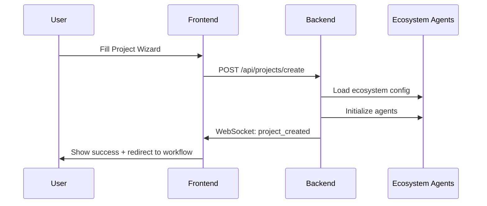
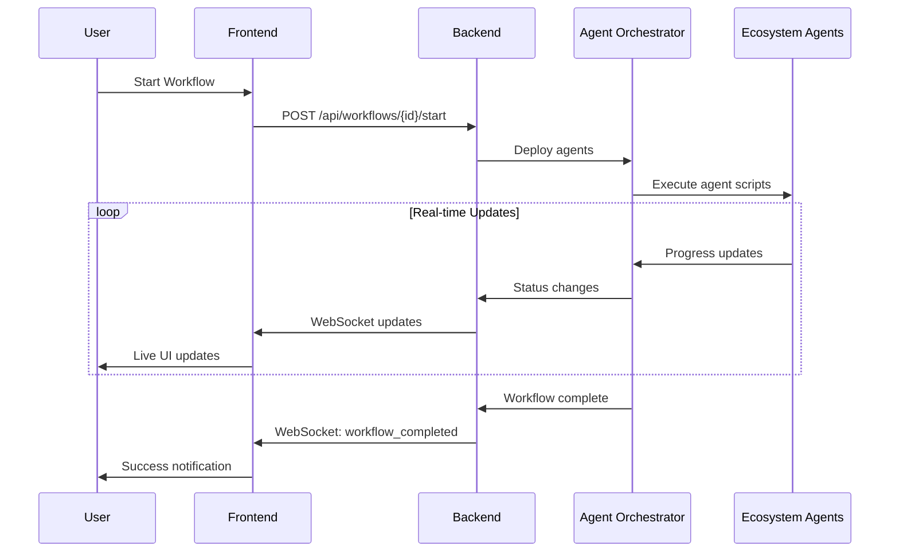

# BMAD UI - System Architecture

## Architecture Overview

BMAD UI follows a modern full-stack architecture designed to integrate seamlessly with Gil's development ecosystem while providing a cosmic-themed, real-time user experience.

## System Architecture Diagram

```
┌─────────────────────────────────────────────────────────────┐
│                    Gil's Dev Ecosystem                       │
│  ┌─────────────────┐    ┌─────────────────────────────────┐ │
│  │   .bmad-core/   │    │         agents/                 │ │
│  │ core-config.yaml│    │ ├── project_creator/            │ │
│  │                 │    │ ├── feature_builder/           │ │
│  │                 │    │ ├── integration_helper/        │ │
│  │                 │    │ └── debugging_assistant/       │ │
│  └─────────────────┘    └─────────────────────────────────┘ │
│           │                           │                      │
│           └──────────┬────────────────┘                      │
│                      │                                       │
└──────────────────────┼───────────────────────────────────────┘
                       │
    ┌──────────────────┼──────────────────┐
    │              BMAD UI                 │
    │                  │                  │
    │  ┌───────────────▼────────────────┐ │
    │  │        Frontend                │ │
    │  │     (Next.js 15.4.6)          │ │
    │  │                                │ │
    │  │ ┌─────────────────────────────┐│ │
    │  │ │   Cosmic Mission Control   ││ │
    │  │ │      Components            ││ │
    │  │ │                            ││ │
    │  │ │ • CosmicDashboard          ││ │
    │  │ │ • ProjectCreationWizard    ││ │
    │  │ │ • BMADWorkflow             ││ │
    │  │ │ • Real-time UI Updates     ││ │
    │  │ └─────────────────────────────┘│ │
    │  └────────────────────────────────┘ │
    │                  │                  │
    │        WebSocket │ HTTP API         │
    │                  │                  │
    │  ┌───────────────▼────────────────┐ │
    │  │         Backend                │ │
    │  │       (FastAPI)                │ │
    │  │                                │ │
    │  │ ┌─────────────────────────────┐│ │
    │  │ │    Integration Layer        ││ │
    │  │ │                            ││ │
    │  │ │ • bmad_integration.py      ││ │
    │  │ │ • agent_orchestrator.py    ││ │
    │  │ │ • project_manager.py       ││ │
    │  │ │ • websocket_manager.py     ││ │
    │  │ └─────────────────────────────┘│ │
    │  └────────────────────────────────┘ │
    └─────────────────────────────────────┘
```

## Component Architecture

### Frontend Architecture (Next.js 15.4.6)

```
frontend/src/
├── app/                          # Next.js App Router
│   ├── layout.tsx               # Root layout with cosmic theme
│   ├── page.tsx                 # Main application entry  
│   └── globals.css              # Cosmic theme styles
│
├── components/                   # React Components
│   ├── CosmicDashboard.tsx      # Mission control interface
│   ├── ProjectCreationWizard.tsx # Multi-step project creation
│   └── BMADWorkflow.tsx         # Workflow execution UI
│
├── lib/                         # Utilities
├── hooks/                       # Custom React hooks  
├── types/                       # TypeScript definitions
└── styles/                      # Additional styles
```

#### Key Frontend Technologies
- **Next.js 15.4.6** - React framework with App Router
- **TypeScript** - Type-safe development
- **Tailwind CSS** - Utility-first styling with cosmic theme
- **Framer Motion** - Smooth animations and transitions
- **Socket.IO Client** - Real-time WebSocket communication
- **React Hook Form + Zod** - Form validation and management
- **Radix UI** - Accessible component primitives

### Backend Architecture (FastAPI)

```
backend/
├── main.py                      # FastAPI application entry
├── bmad_integration.py         # Ecosystem integration
├── websocket_manager.py        # Real-time communication
├── project_manager.py          # Project lifecycle
├── agent_orchestrator.py      # Agent coordination
└── requirements.txt            # Python dependencies
```

#### Key Backend Technologies
- **FastAPI** - Modern Python web framework
- **WebSockets** - Real-time bi-directional communication
- **Pydantic** - Data validation and serialization
- **AsyncIO** - Asynchronous programming
- **PyYAML** - Configuration file parsing

## Integration Architecture

### Ecosystem Integration Pattern

The BMAD UI integrates with Gil's ecosystem through a layered approach:

```python
# Integration Layer Hierarchy
EcosystemRoot (gil-dev-ecosystem/)
├── .bmad-core/core-config.yaml     # Configuration source
├── agents/                         # Ecosystem agents
│   ├── project_creator/
│   ├── feature_builder/
│   ├── integration_helper/
│   └── debugging_assistant/
├── infrastructure/templates/       # Project templates
└── projects/bmad-ui/              # This application
    ├── frontend/                   # UI layer
    └── backend/                    # Integration layer
```

### BMAD Core Integration

```python
class BMADCoreIntegration:
    """Integration with Gil's ecosystem structure"""
    
    def __init__(self):
        # Points to ecosystem root, not copied bmad-core
        self.ecosystem_root = Path("../../..")
        self.ecosystem_config_path = self.ecosystem_root / ".bmad-core/core-config.yaml"
        self.ecosystem_agents_path = self.ecosystem_root / "agents"
        
    async def _load_ecosystem_agents(self):
        """Load agents from ecosystem, not from copied files"""
        bmad_agents = self.ecosystem_config.get("bmad_agents", {})
        # Maps to actual ecosystem agent scripts
        for agent_id, config in bmad_agents.items():
            agent_script = self.ecosystem_agents_path / config["handler"] / f"{config['handler']}.py"
```

## Data Flow Architecture

### Project Creation Flow



### Workflow Execution Flow



## Cosmic UI Architecture

### Theme System

```css
/* Cosmic Mission Control Theme */
:root {
  --cosmic-primary: #00ff41;      /* Matrix green */
  --cosmic-secondary: #0066ff;    /* Cosmic blue */
  --cosmic-accent: #ff0066;       /* Alert red */
  --cosmic-bg: #000011;           /* Deep space */
  --cosmic-surface: #001122;      /* Surface panels */
  --cosmic-glass: rgba(255, 255, 255, 0.1);  /* Glass morphism */
}
```

### Component Hierarchy

```
App Layout (Cosmic Background)
├── Navigation Header (Glass morphism)
├── Main Content Area
│   ├── CosmicDashboard (Default view)
│   │   ├── System Status Grid
│   │   ├── Mission Control Cards  
│   │   ├── Command Console
│   │   └── Quick Actions
│   ├── ProjectCreationWizard (Modal/Page)
│   │   ├── Step Progress Indicator
│   │   ├── Mission Parameters Form
│   │   ├── Tech Stack Selection
│   │   ├── Agent Team Configuration
│   │   └── Mission Briefing Confirmation
│   └── BMADWorkflow (Execution view)
│       ├── Workflow Progress Timeline
│       ├── Agent Status Panel
│       ├── Real-time Terminal Output
│       └── Control Buttons
└── Status Bar (System info)
```

## Real-time Communication Architecture

### WebSocket Architecture

```python
class ConnectionManager:
    """Manages WebSocket connections and real-time updates"""
    
    # Connection Types
    active_connections: List[WebSocket]           # All connected clients
    project_subscriptions: Dict[str, Set[WebSocket]]  # Project-specific subscriptions
    
    # Event Types
    - connection_established
    - project_created  
    - workflow_started
    - step_progress
    - agent_status_update
    - workflow_completed
    - system_status_update
```

### Message Flow Pattern

```
Frontend ←→ WebSocket ←→ Backend ←→ Agent Orchestrator ←→ Ecosystem Agents
    │                       │                               │
    └── Real-time UI ──────└── Event Broadcasting ────────└── Agent Execution
```

## Security Architecture

### Security Layers

1. **Input Validation**
   - Zod schemas for frontend forms
   - Pydantic models for backend APIs
   - SQL injection prevention (when database added)

2. **Network Security**
   - CORS configuration for API access
   - WebSocket origin validation
   - Environment-based configuration

3. **Future Security Enhancements**
   - Authentication middleware
   - Role-based access control
   - API rate limiting
   - Session management

## Performance Architecture

### Frontend Performance

- **Code Splitting** - Dynamic imports for large components
- **Image Optimization** - Next.js automatic optimization
- **Bundle Analysis** - Webpack bundle analyzer
- **Caching Strategy** - Browser and CDN caching

### Backend Performance  

- **Async/Await** - Non-blocking I/O operations
- **Connection Pooling** - Efficient resource management
- **Background Tasks** - Long-running workflows
- **Memory Management** - Proper cleanup and garbage collection

### Real-time Performance

- **WebSocket Optimization** - Connection reuse and heartbeat
- **Event Batching** - Reduce message frequency
- **Selective Updates** - Only send changed data
- **Compression** - Message compression for large payloads

## Deployment Architecture

### Development Environment

```
Local Development Setup:
├── Frontend: localhost:3000 (Next.js dev server)
├── Backend: localhost:8000 (FastAPI with uvicorn)  
└── WebSocket: ws://localhost:8000/ws
```

### Production Architecture (Future)

```
Production Deployment:
├── Frontend: Vercel/Netlify deployment
├── Backend: Docker container (FastAPI + uvicorn)
├── Database: PostgreSQL (future enhancement)
├── Cache: Redis (future enhancement)
└── CDN: Static asset delivery
```

## Monitoring & Observability

### Application Monitoring

- **Health Checks** - Service availability endpoints
- **Performance Metrics** - Response times and throughput
- **Error Tracking** - Exception monitoring and alerting  
- **Usage Analytics** - User interaction patterns

### Real-time System Monitoring

- **WebSocket Connections** - Active connection count
- **Agent Status** - Ecosystem agent health
- **Workflow Execution** - Success/failure rates
- **Resource Utilization** - CPU, memory, network usage

---

**This architecture provides a solid foundation for the cosmic-themed BMAD UI while maintaining clean integration with Gil's development ecosystem! 🚀**